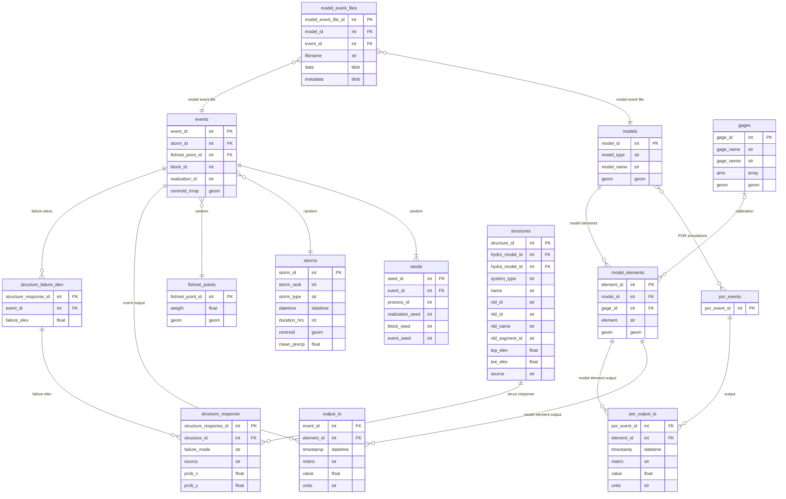

# ffrd-data-model
FFRD Data Model

## Entity Relationship Diagram

## ETL Needs:
* code to load `storms` table from StormHub STAC (already part of StormHub itself, just needs to be uncommented manually)

## Notes / Questions
* gages: ams == annual maxmium series? 
* fishnet: what is `weight`? importance sampling?
* reservoir, levee, and system response tables -- how is this supposed to work?

## Prior Art

