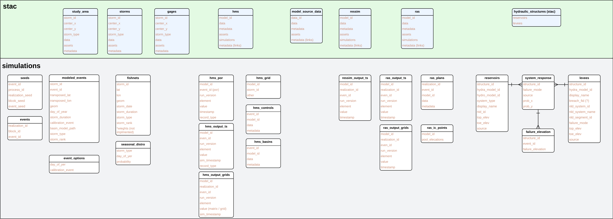

# ffrd-data-model
FFRD Data Model

## Entity Relationship Diagram(s)
* [FFRD Data Model - ERD](./rdb/ffrd-erd-unified.mmd)
* [FFRD Data Model - Grids Detail](./rdb/grids.mmd)
* [FFRD Lakehouse Data Model - ERD](./lakehouse/ffrd-lakehouse.mmd)

## ETL Needs:
* code to load `storms` table from StormHub STAC (already part of StormHub itself, just needs to be uncommented manually)

## Notes / Questions
* MODEL LINKAGES
* gages: ams == annual maxmium series?
* fishnet: what is `weight`? importance sampling?
* reservoir, levee, and system response tables -- how is this supposed to work?
* Gridded data (RAS depth/velocity, HMS excess precip, observed precip) is cataloged in
  [`rdb/grids.mmd`](./rdb/grids.mmd) as two purpose-specific tables backed by long-lived
  Icechunk repositories:
  - `observed_grids`: Real-world meteorology (precip) with `time_start`, `time_end`, `timestep_sec`.
  - `output_grids`: Model outputs (RAS max values and HMS synthetic durations) with `duration_sec`
    populated for HMS excess precip and null for RAS depth/velocity.
  Both reference `grid_repos` for repository metadata (crs, resolution). Transposed/event-specific
  precipitation is computed at runtime and not persisted separately.

## Prior Art

