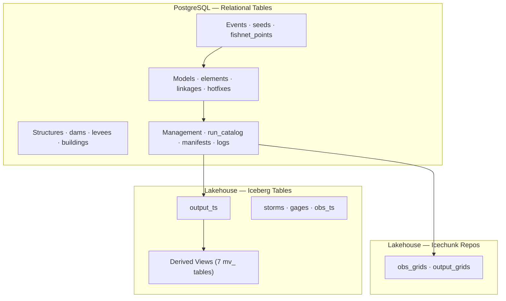

# FFRD Data Model

Data model for the FEMA Future of Flood Risk Data (FFRD) cloud-compute system. Defines the schema for stochastic flood risk simulation — from storm catalogs and model registration through cloud execution, results ingestion, and derived analytics.

## Architecture

The data model spans three storage tiers:

| Tier | Technology | Purpose |
|------|-----------|---------|
| **Relational** | PostgreSQL | Models, structures, events, run management, consequence results |
| **Tabular** | Apache Iceberg | High-volume time series (observed & modeled), storm catalog, gage metadata, materialized views |
| **Gridded** | Icechunk (Zarr) | Observed and modeled gridded data (precipitation, depth, velocity) |



> See [`ffrd-erd.mmd`](ffrd-erd.mmd) for the full interactive ERD with clickable links to each domain diagram.

## Repository Layout

```
ffrd-erd.mmd                     ← unified entity-relationship diagram
data-dictionary.yaml             ← canonical data dictionary (YAML)
data-dictionary.md               ← auto-generated readable version

rdb/                             ← PostgreSQL domain diagrams
lakehouse/                       ← Iceberg / Icechunk domain diagrams

docs/                            ← supplemental documentation
  user-guide.md                    workflow, data population sequence, provenance
  user-stories.md                  33 user stories by persona
  user-stories-validated.md        story-to-table validation matrix
  grids.mmd                        Icechunk repository flowchart
  tables.mmd                       Iceberg table flowchart
  cc-mapping/                      plugin-to-data-model mapping specs
  prior-art/                       reference diagrams and archived materials
```

## Documentation

| Document | Description |
|----------|-------------|
| [User Guide](docs/readme.md) | Data population workflow, provenance tracing, plugin mapping |
| [Data Dictionary](data-dictionary.md) | Every table and column with types, constraints, and descriptions |
| [User Stories](docs/user-stories.md) | 33 use cases organized by persona |
| [Story Validation](docs/user-stories-validated.md) | How each story maps to specific tables and columns |


## Conventions

- **Source of truth:** The `.mmd` files in `rdb/` and `lakehouse/` are the authoritative schema definitions
- **Data dictionary:** `data-dictionary.yaml` is derived from the `.mmd` files and kept in sync manually
- **STAC metadata:** Semi-structured metadata (conformance checks, input datasets, dam scoping) lives in external STAC documents referenced by `stac_metadata` URI columns
- **Iceberg keys:** Logical only — no enforced PK/FK constraints; integrity is maintained at the ingestion layer
- **Plugin mappings:** Per-plugin ETL specs in `docs/cc-mapping/` document how raw CC outputs are transformed into the data model


---
 
*__Note__:* Regenerate the readable data dictionary from the YAML source (create `data-dictionary.md` from `data-dictionary.yaml`):

```bash
python preview_dict.py
```