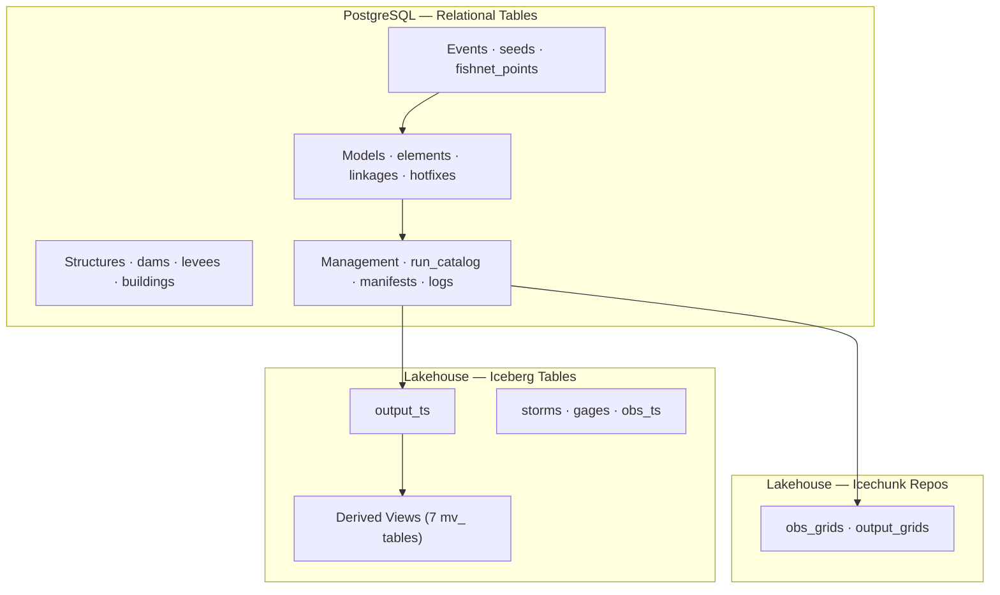

# FFRD Data Model

Data model for the FEMA Future of Flood Risk Data (FFRD) cloud-compute system. Defines the schema for stochastic flood risk simulation — from storm catalogs and model registration through cloud execution, results ingestion, and derived analytics.

## Architecture

The data model spans three storage tiers:

| Tier | Technology | Purpose |
|------|-----------|---------|
| **Relational** | PostgreSQL | Models, structures, events, run management, consequence results |
| **Tabular** | Apache Iceberg | High-volume time series (observed & modeled), storm catalog, gage metadata, materialized views |
| **Gridded** | Icechunk (Zarr) | Observed and modeled gridded data (precipitation, depth, velocity) |



> See [`ffrd-erd.mmd`](ffrd-erd.mmd) for the full interactive ERD with clickable links to each domain diagram.

### Why Three Tiers

FFRD's stochastic flood-risk pipeline produces data that varies by several orders of magnitude in volume, shape, and access pattern. No single storage technology handles all of it well, so the model separates concerns into three purpose-built tiers:

| Concern | Tier Choice | Rationale |
|---------|-------------|-----------|
| **Relational integrity** | PostgreSQL | Model registration, run management, structural inventories, and consequence results have rich foreign-key relationships and require ACID transactions. PostgreSQL enforces referential integrity and supports the provenance joins that let any published result be traced back to its storm, model version, and execution context. |
| **Analytical scale** | Apache Iceberg | A full stochastic ensemble generates billions of time-series records. Iceberg provides schema evolution, time travel, and partition pruning over cloud object storage, enabling distributed analytics (Spark, Dask) without a running database server. Materialized views (`mv_*` tables) pre-compute the most common queries while remaining rebuildable from source tables. |
| **N-dimensional grids** | Icechunk (Zarr) | Precipitation fields, depth grids, and velocity arrays are inherently multi-dimensional (x, y, time, realization). Zarr stores them natively with chunked, cloud-optimized access — avoiding the overhead and information loss of flattening grids into rows or columns. Icechunk adds Git-like versioning on top. |

Additional design drivers:

- **Cost alignment** — Hot operational metadata stays in PostgreSQL; high-volume analytical and gridded data lives in object storage where per-GB costs are orders of magnitude lower.
- **Open standards** — All three tiers (PostgreSQL, Apache Iceberg, Zarr) are open-source, vendor-neutral formats, preventing lock-in and enabling a broad tool ecosystem.
- **Provenance by design** — The `run_catalog → manifests → events → storms` join chain gives every output a complete lineage record (software version, model version, storm, spatial placement, random seeds) without relying on external metadata stores.

## Repository Layout

```
ffrd-erd.mmd                     ← unified entity-relationship diagram
data-dictionary.yaml             ← canonical data dictionary (YAML)
data-dictionary.md               ← auto-generated readable version

rdb/                             ← PostgreSQL domain diagrams
lakehouse/                       ← Iceberg / Icechunk domain diagrams

docs/                            ← supplemental documentation
  readme.md                        workflow, data population sequence, provenance
  user-stories.md                  33 user stories by persona
  user-stories-validated.md        story-to-table validation matrix
  grids.mmd                        Icechunk repository flowchart
  icechunk.md                      detailed Icechunk schema and derived products
  tables.mmd                       Iceberg table flowchart
  cc-mapping/                      plugin-to-data-model mapping specs
  prior-art/                       reference diagrams and archived materials
```

## Documentation

| Document | Description |
|----------|-------------|
| [User Guide](docs/readme.md) | Data population workflow, provenance tracing, plugin mapping |
| [Data Dictionary](data-dictionary.md) | Every table and column with types, constraints, and descriptions |
| [Gridded Data](docs/icechunk.md) | Icechunk repositories, xarray schemas, derived products |
| [Icechunk Diagram](docs/grids.mmd) | Flowchart of source and derived gridded repositories |
| [User Stories](docs/user-stories.md) | 33 use cases organized by persona |
| [Story Validation](docs/user-stories-validated.md) | How each story maps to specific tables and columns |


## Conventions

- **Source of truth:** The `.mmd` files in `rdb/` and `lakehouse/` are the authoritative schema definitions
- **Data dictionary:** `data-dictionary.yaml` is derived from the `.mmd` files and kept in sync manually
- **STAC metadata:** Semi-structured metadata (conformance checks, input datasets, dam scoping) lives in external STAC documents referenced by `stac_metadata` URI columns
- **Iceberg keys:** Logical only — no enforced PK/FK constraints; integrity is maintained at the ingestion layer
- **Plugin mappings:** Per-plugin ETL specs in `docs/cc-mapping/` document how raw CC outputs are transformed into the data model


---
 
*__Note__:* Regenerate the readable data dictionary from the YAML source (create `data-dictionary.md` from `data-dictionary.yaml`):

```bash
python preview_dict.py
```
