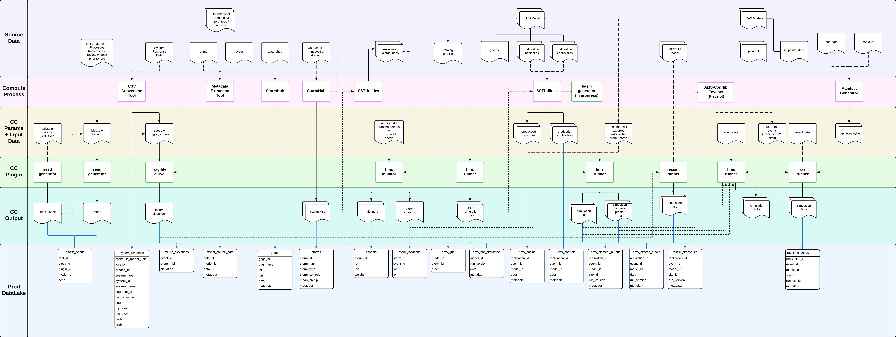

# User Guide — FFRD Data Model Workflow

This guide describes how data flows through the FFRD cloud-compute system, the order in which tables are populated, and how to trace any result back to the software, model, and inputs that produced it.

For column-level detail see the [Data Dictionary](../data-dictionary.md). For the unified entity diagram see [`ffrd-erd.mmd`](../ffrd-erd.mmd).

---

## Prior Art

This diagram was the starting point for the data model included in this repository:




This diagram shows how individual CC plugins (HMS precipitation, HMS excess precip, RAS depth grids, etc.) produce outputs that are ingested into Iceberg tables and Icechunk repositories.

> **Note:** This diagram predates the current schema and uses legacy naming. It is included here as architectural context for *why* the data model is structured the way it is.

---

## Data Population Sequence

The tables are populated in six phases. Each phase depends on the previous one.

```
Phase 1          Phase 2          Phase 3          Phase 4          Phase 5          Phase 6
Input Prep  ───► Model Reg  ───► Execution  ───► Results     ───► Derived     ───► Consequences
                                                  Ingestion       Products        Analysis
```

### Phase 1 — Input Preparation

Authoritative input datasets are loaded before any model runs. These are the foundational reference data.

| Table | Storage | Description |
|-------|---------|-------------|
| `storms` | Iceberg | Stochastic storm catalog with gridded precipitation (NetCDF + Icechunk) |
| `obs_grids` | Icechunk | Registry of observed gridded data repos (e.g. AORC precipitation) |

> See the [Iceberg table flowchart](tables.mmd) for a visual overview of Phase 1 tabular data.
| `gages` | Iceberg | Stream and reservoir gage metadata |
| `obs_ts` | Iceberg | Observed time series from gages (flow, stage) |
| `fishnet_points` | PostgreSQL | Spatial sampling grid with frequency weights |
| `levees` | PostgreSQL | Levee inventory from NLD |
| `dams` | PostgreSQL | Dam inventory from NID |
| `buildings` | PostgreSQL | Building inventory from NSI/HAZUS |
| `structure_response` | PostgreSQL | Fragility/response functions for dams and levees |

### Phase 2 — Model Registration

Models are registered with their elements, inter-model linkages, and gage associations.

| Table | Storage | Description |
|-------|---------|-------------|
| `models` | PostgreSQL | HEC-HMS, HEC-RAS, ResSim model records with `stac_metadata` |
| `model_elements` | PostgreSQL | Junctions, subbasins, 2D flow areas, BCs, reaches |
| `model_linkages` | PostgreSQL | Donor → receiver connections between models |

### Phase 3 — Execution

Each cloud-compute run pairs one event with one model version. The management tables capture everything about the execution.

| Table | Storage | Description |
|-------|---------|-------------|
| `events` | PostgreSQL | Realized simulation events (storm + fishnet point + block + realization) |
| `seeds` | PostgreSQL | Random seeds for reproducibility |
| `run_catalog` | PostgreSQL | One row per run: event, model, type, success/failure |
| `manifests` | PostgreSQL | Software configuration — plugin names, versions, linkage version |
| `run_logs` | PostgreSQL | URI to full container execution log |
| `run_resources` | PostgreSQL | CPU hours, memory, storage consumed |
| `run_files` | PostgreSQL | URIs to raw CC output file artifacts |

### Phase 4 — Results Ingestion

After a run completes, its outputs are parsed and written to the lakehouse.

| Table | Storage | Description |
|-------|---------|-------------|
| `output_ts` | Iceberg | Modeled time series (flow, stage, volume) per element per run |
| `output_grids` | Icechunk | Registry of gridded output repos (excess precip, depth, velocity) |

> See the [Icechunk repository flowchart](grids.mmd) for how gridded data flows into obs_grids and output_grids. For detailed repository schemas and derived products, see [icechunk.md](icechunk.md).

### Phase 5 — Derived Products

Materialized views are regenerated from the source Iceberg tables after batch commits. They pre-compute the most common analytical queries.

| Table | Refresh Trigger | Purpose |
|-------|----------------|---------|
| `mv_peak_output_by_element` | After run batch | Peak value per element per variable |
| `mv_event_variable_stats` | After run batch | Summary stats across elements per event |
| `mv_aep_frequency_stats` | After full ensemble | Frequency statistics with uncertainty bounds |
| `mv_gage_model_comparison` | When obs_ts or output_ts updated | Observed vs. modeled peak comparison |
| `mv_run_performance` | After run + resources write | Per-run timing and cost |
| `mv_basin_cost_rollup` | Daily / on-demand | Monthly cost rollup per basin |
| `mv_conformance_summary` | After conformance gate review | Pass/fail per check per model version |

### Phase 6 — Consequence Analysis

Structure-level consequence results are written after RAS depth grids are attributed to the building inventory.

| Table | Storage | Description |
|-------|---------|-------------|
| `structure_failure_elev` | PostgreSQL | Per-event failure WSE for each structure (from fragility + random sampling) |
| `buildings_impacted` | PostgreSQL | Per-event inundation depth at each building (from RAS depth grids) |

---

## Tracing a Plugin to Its Data

Every CC run is executed by a specific set of plugins at specific versions. The `manifests` table records this configuration.

```
manifests
  ├── plugin_name        e.g. "hec-hms", "hec-ras", "fragility-sampler"
  ├── plugin_version     e.g. "4.12.0"
  ├── linkage_version    e.g. "v2.1"
  └── run_id ──► run_catalog
                   ├── model_id ──► models (which basin/version)
                   ├── event_id ──► events (which storm/placement)
                   └── run_type    "calibration", "conformance", "hotfix"
```

**To answer "what software produced this result":**

1. Start with `output_ts.run_id` (or `output_grids` via `run_catalog`)
2. Join to `run_catalog` → `manifests`
3. Read `plugin_name`, `plugin_version`, `linkage_version`
4. The manifest `uri` points to the full manifest document for complete configuration details

---

## Tracing a Result Back to Its Inputs

The full provenance chain from any output value back to the originating storm and precipitation data:

```
output_ts.value
  └── run_id ──► run_catalog
                   ├── model_id ──► models.stac_metadata (model artifacts, input datasets)
                   ├── event_id ──► events
                   │                  ├── storm_id ──► storms
                   │                  │                  ├── stac_metadata (storm metadata)
                   │                  │                  ├── netcdf (precipitation grid file)
                   │                  │                  └── icechunk_repo (Zarr-backed grid)
                   │                  └── fishnet_point_id ──► fishnet_points (spatial placement + weight)
                   └── run_type, success, timestamp
```

For gridded results, `output_grids.index_key` (= `event_id`) provides the same traceability through `run_catalog` → `events` → `storms`.

---

## Plugin-to-Data Mappings

The `docs/cc-mapping/` directory contains per-plugin mapping specifications that document how raw plugin output files are transformed into the tabular data model. Each mapping file describes:

- **Source format** — The raw file or JSON structure produced by the plugin
- **Target tables** — Which data model tables receive the data
- **Field mapping** — Source field → target column correspondence
- **Normalization rules** — Type casting, array expansion, validation

Currently documented mappings:

| Mapping File | Plugin Domain | Target Tables |
|-------------|---------------|---------------|
| [`conformance_system_response_curves.md`](cc-mapping/conformance_system_response_curves.md) | Structure fragility | `dams`, `levees`, `structure_response` |

Additional plugin mappings will be added as ingestion pipelines are built for other CC outputs (e.g. HMS results, RAS depth grids, consequence outputs).

---

## Conventions

- **Source of truth:** The `.mmd` files in `rdb/` and `lakehouse/` are the authoritative schema definitions
- **STAC metadata:** Rich, semi-structured metadata (conformance checks, input dataset provenance, dam scoping decisions) is stored in external STAC documents referenced by `stac_metadata` URI columns on `models`, `dams`, `levees`, `gages`, and `storms`
- **No enforced FK in Iceberg:** Iceberg tables use logical keys only — referential integrity is enforced at the application/ingestion layer
- **Icechunk repos:** `obs_grids` and `output_grids` are registries pointing to Zarr-backed Icechunk stores, not tabular data themselves
