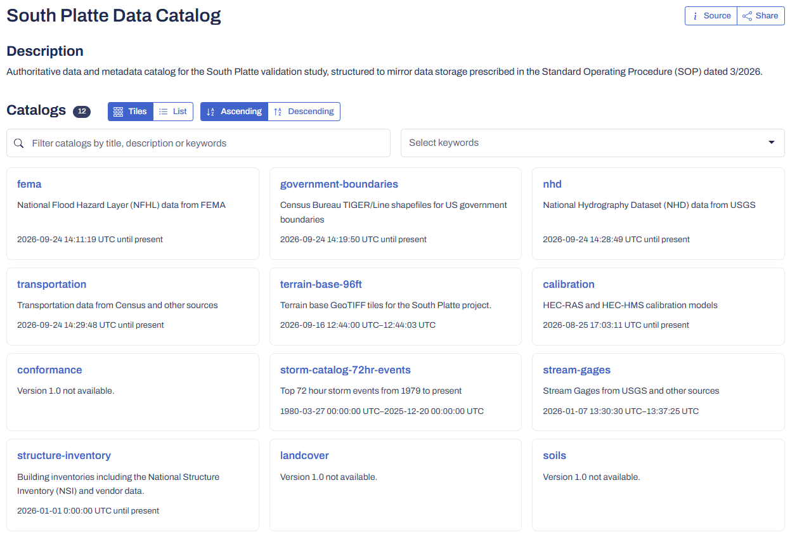
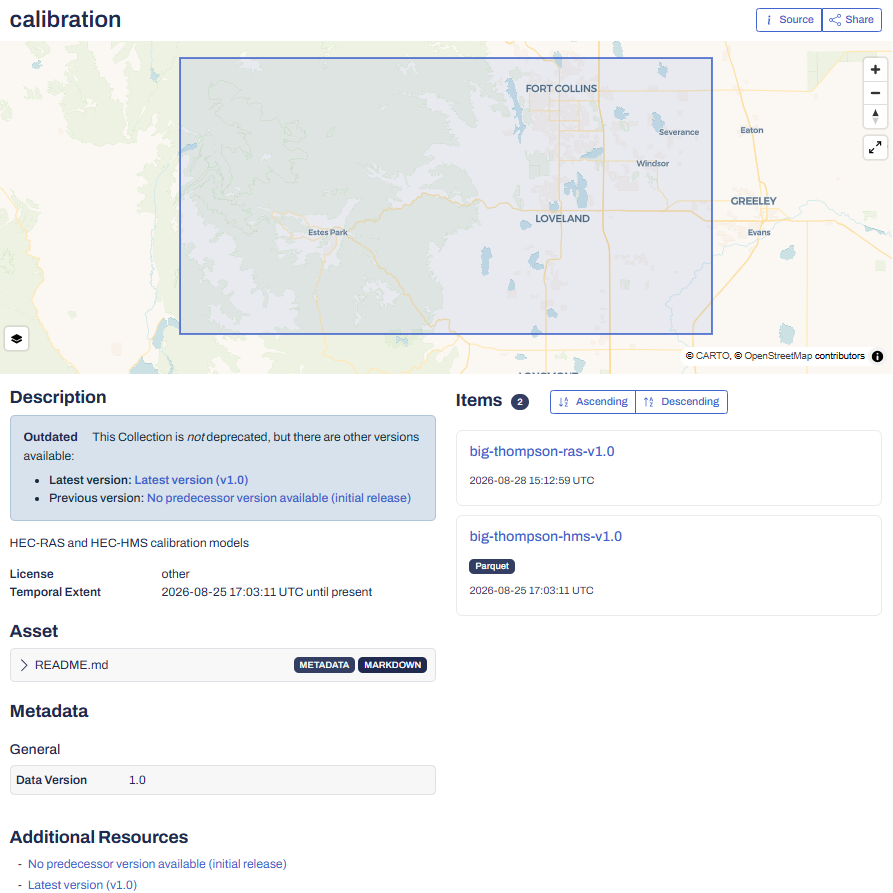

# Example metadata

This folder contains example STAC metadata for the South Platte development catalog, including the catalog view and a calibration collection example.

Catalog example showing the South Platte development catalog.

Collection example showing the versioned calibration metadata.
